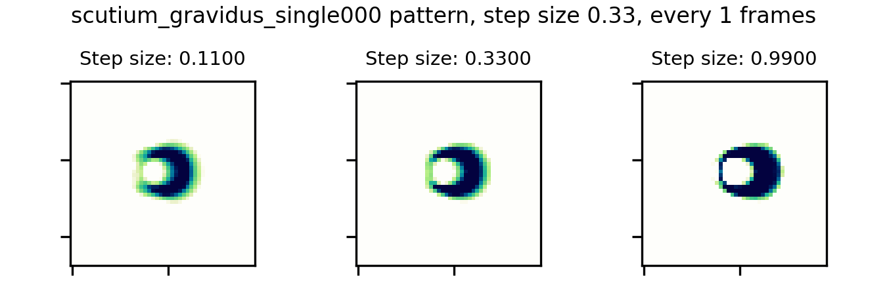
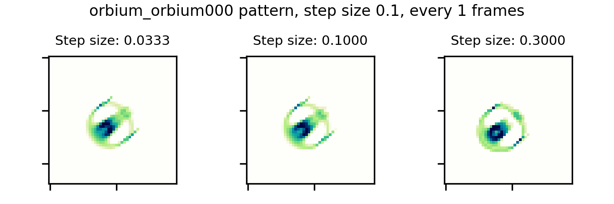
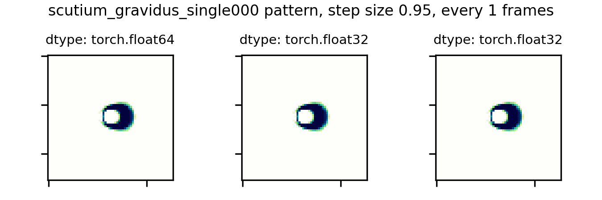
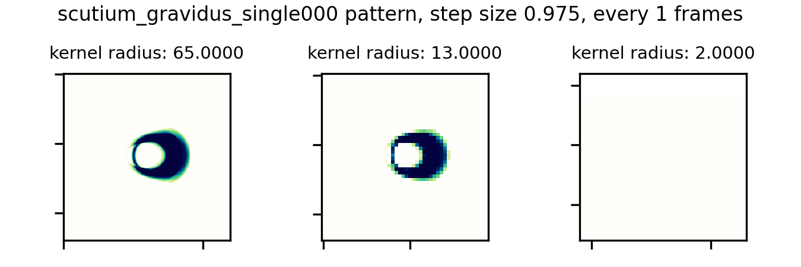

# Animations for 'Intention to explore the role of discretization in the emergence of self-organization in certain approximations of continuous cellular automata and dynamic systems'

These animations are supporting material for an intention paper, sometimes also known as a [registered report](https://web.archive.org/web/20220303054412/https://royalsociety.org/blog/2016/11/registered-reports-what-are-they-and-why-are-they-important/) when incorporated into the peer review process. The purpose is to lay out the motivation and intention for experiments and what the various results of said experiments might mean. 

Based on the animations below and on previous work with discrete time step sizes ([Davis and Bongard 2022](https://direct.mit.edu/isal/proceedings/isal/34/43/112315)), discretization approximations in computer implementations of nominally continuous cellular automata (CA) can be essential parameters for supporting self-organizing dynamics. Although we do see consequences of the intuitive accuracy/computational resources trade-off, where we would expect simulations to behave strangely and become unstable with approximations that are too coarse, for some patterns approximating the continuous ideal too closely destabilizes self-organizing patterns. Some patterns, like the small glider in the _Scutium gravidus_ rule set from the Lenia CA framework ([Chan 2019](https://www.complex-systems.com/abstracts/v28_i03_a01/)) depend on simulation coarseness to persist. 

### Figure 1 animation

{:style="text-align:center;"}

Animation corresponding to Figure 1 in the intention article. A small glider in the _Scutium gravidus_ set of Lenia CA rules becomes unstable with too small and too large step size.  
{:style="text-align:center;"}

### Figure 2 animation

{:style="text-align:center;"}

Animation corresponding to Figure 2 in the intention article. A small Lenia glider, _Orbium_, becomes unstable with too large, but not too small, step size.  
{
{:style="text-align:center;"}

### Figure 3 animation

{:style="text-align:center;"}

Animation corresponding to Figure 3 in the intention article. A small glider in the _Scutium gravidus_ set of Lenia CA rules becomes unstable when using the higher-precision `torch.float64`double data type.  
{
{:style="text-align:center;"}

### Figure 4 animation

{:style="text-align:center;"}

Animation corresponding to Figure 4 in the intention article. A small Lenia glider in called _Orbium_ does not become unstable when using the higher-precision `torch.float64`double data type.  
{:style="text-align:center;"}

### Figure 5 animation

{:style="text-align:center;"}

Animation corresponding to Figure 5 in the intention article. A larger kernel size of radius 65, corresponding to smaller (better) spatial resolution, leads to instability in a small _Scutium gravidus_ Lenia glider after about 24 steps. The simulation with radius 2 kernel predictably vanishes immediately. 
{:style="text-align:center;"}

### Figure 6 animation

{:style="text-align:center;"}

Animation corresponding to Figure 6 in the intention article. A larger kernel size of radius 65, corresponding to smaller (better) spatial resolution, is well tolerated by a small Lenia glider, _Orbium_. The glider remains stable after 512 steps at the "native" kernel radius of 13 and the enlarged radius of 65.
{:style="text-align:center;"}

